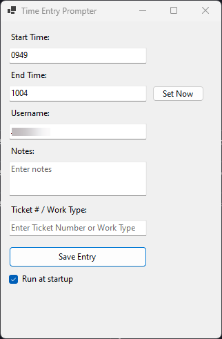

# TimeEntryPrompter

## Overview
`TimeEntryPrompter` is a Windows Forms application that prompts users to submit time entries at 15-minute intervals between 8 AM and 5 PM. It allows for easy tracking of time spent on different tasks or tickets and helps ensure accurate time logging.

## Features
- **Automatic 15-Minute Prompts**: The app reminds users every 15 minutes within specified hours to submit their time entry, ensuring time records are up to date.
- **Customizable Inputs**: Users can input their username, start and end times (in 24-hour format), ticket number/work type, and additional notes.
- **Webhook Integration**: The data is sent to a configured webhook for processing or storage.
- **Run at Startup**: Users can choose to start the application automatically on system reboot.

## Setup Instructions
1. **Clone the Repository**:
   ```bash
   git clone <repository_url>
   cd TimeEntryPrompter
   ```

2. **Open in Visual Studio Code**:
   ```bash
   code .
   ```

3. **Run the Application**:
   Use the .NET CLI to build and run the application. When running for the first time, it will prompt for the webhook URL to send the information to.
   ```bash
   dotnet run
   ```
   - **Note**: Import the Rewst workflow from the `Resources` folder to get the webhook trigger URL required for data submission.

4. **Configure Webhook URL**:
   Once the webhook is established, enter it when prompted. This enables data submissions to the specified endpoint.

5. **Run at Startup**:
   Install the app using the `timeentrypromptersetup.exe` file in the `Resources/Output` folder. You can also use Inno Setup to create an installer for the app (see `Resources/inno_setup.iss` for script). Select the "Run at startup" option within the application to ensure it launches automatically every time the computer restarts.

## Usage Notes

- **Time Format**: Start and end times use 24-hour format. For example:
  - `0830` for 8:30 AM
  - `1312` for 1:12 PM
- **Ticket # / Work Type**: Enter a ticket number or work type to associate the time entry with a specific task. If left blank, entries default to "Admin".

## Dependencies
- **.NET 8.0**: Ensure .NET 8.0 is installed to build and run this application.

---

### Application Screenshot


This screenshot shows the main interface of the `TimeEntryPrompter` application, where users can input start and end times, notes, and ticket numbers/work types.

---

### Resources
- [Rewst Workflow](Resources/workflow-018da325-a5ca-7755-9e8d-02f7d84b997c_20241113_140550.bundle.json)
- [Inno Setup Script](Resources/inno_setup.iss)
- [Installer](Resources/Output/timeentrypromptersetup.exe)
- [Inno Setup Compiler](https://www.jrsoftware.org/isdl.php)

---

## License
This project is licensed under the [AGPL License](LICENSE), making it open source and encouraging community collaboration.